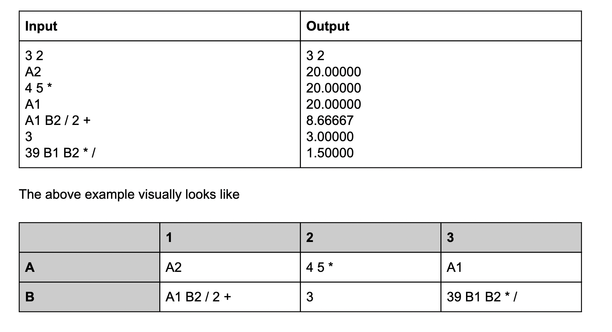

# SpreadSheet Calculator using RPN

This python program is an abstract implementation of how values in Cells in Spreadsheet are computed using the concept of RPN and the use of stack to evaluate those values for the formulaes in each given cell.

The input is to read a spreadsheet from `stdin`, evaluate the values of all the cells and write the output to `stdout`.

The spreadsheet input is defined as follows:
<br/>● Line 1: two integers, defining the width and height of the spreadsheet (n, m)
<br/>● n*m lines each containing an expression which is the value of the corresponding cell
(cells enumerated in the order A1, A2, A<n>, B1, …)

Visual Representation of Input and Output is as follows:


### Algorithm:
1. Read all the input from `stdin` line by line
2. Store each cell expression to a global dictionary
3. Iterate through all cell expression - add it to set of cells that needs to be evaluated if that cell value is not already computed.
4. For each expression in evaluated set - use the RPN function to parse and analyze the expression, the result of which can be stored in the corresponding computed cell dictionary.
5. If a cell reference already exists in evaluated cells, then a cycle has been detected, post which it exits with non-zero code.
6. Store and format the result with double precision and output the final values.

### Input Test Cases:
1. input.txt -> contains the input as mentioned in the description above.
2. unary.txt -> contains the input which has unary operator
3. cycle.txt -> contains the input which throws Cycle Dependency Error along with cell reference number

### To run the code:
```
cat input.txt | python main.py
cat unary.txt | python main.py
cat cycle.txt | python main.py
```